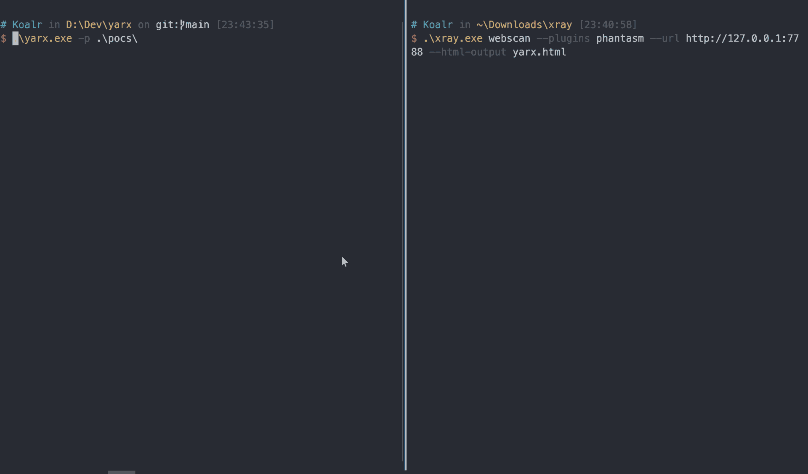

<div align="center">

</div>

<p align="center">
    <a href="https://yarx.koalr.me/"><b>在线体验</b></a>&nbsp;&nbsp;&nbsp;
    <a href="https://yarx.koalr.me/report.html"><b>漏洞报告</b></a> 
</p>

## Yarx 是什么

Yarx 来自于 `x-r-a-y` 的反向拼写，它能够根据 xray 的 yaml poc 规则全自动的生成一个满足规则要求的 Server，使用 xray 扫描该 Server 将会扫描出对应的漏洞。它的核心工作原理如下：





它的主要特性有:

+ 支持 status、header、body 等位置的响应变换
+ 支持 `==` `contains` `submatch` 等各种匹配模式
+ 支持动态变量的渲染和捕获以及多级规则的变量追踪
+ 支持绝大部分内置函数的解析和调用
+ 通过路由合并和智能排序等策略有效减少路由冲突
+ 平铺式规则处理逻辑，支持并发扫描
+ 支持捕获扫描事件做进一步分析联动

## 立即尝试

```bash
./xray webscan --plugins phantasm --html-output yarx.html --url https://yarx.koalr.me
```



几秒钟后你就会得到一个类似的漏洞报告:  [report.html](https://yarx.koalr.me/report.html)


## 安装
+ Github Release

  [https://github.com/zema1/yarx/releases](https://github.com/zema1/yarx/releases)
  下载合适的版本然后从命令行运行即可

+ 源码安装
  ```bash
  git clone https://github.com/zema1/yarx
  cd yarx
  go build -o yarx ./cmd/yarx
  ```

## 用法

```bash
USAGE:
   yarx [global options] [arguments...]

GLOBAL OPTIONS:
   --pocs value, -p value    load pocs from this dir
   --listen value, -l value  the http server listen address (default: "127.0.0.1:7788")
   --root value, -r value    load files form this directory if the requested path is not found

   --verbose, -V             verbose mode, which is  equivalent to --log-level debug (default: false)
   --help, -h                show help (default: false)
```

使用示例：

```bash
# 在8080端口创建一个 http 服务，这个服务将模拟 pocs 文件夹下的所有漏洞
./yarx -p ./pocs -l 0.0.0.0:8080

# 和上面类似，但当路径不存在时，会从 `./www/html` 加载文件
./yarx -p ./pocs -l 0.0.0.0:8080 -r ./www/html
```


你可以使用本仓库的 [pocs](./pocs) 文件夹，也可以直接使用 xray 官方仓库的 [https://github.com/chaitin/xray/tree/master/pocs](https://github.com/chaitin/xray/tree/master/pocs) 文件夹。本仓库仅仅是去掉了暂时不支持的 poc，后者除了在运行时会打印一点错误信息之外没有任何区别，我会定期同步数据来增加更多 poc。当然，你也可以指定自己编写的 poc。

## 开发

Yarx 也可以作为 go 的 package 来使用

```go
yr := &yarx.Yarx{}
// err := yr.Parse([]byte("poc-data"))
err := yr.ParseFile("/path/to/a/yaml/poc")
if err != nil {
    panic(err)
}

// 每个成功加载的 poc 对应一个 MutationChain
// poc 中的 rule 则对应于 MutationRule
chains := yr.Chains()
rules := yr.Rules()
...

// 一键生成上述规则的 http handler
handler := yr.HTTPHandler()

// 事件处理
handler.OnRuleMatch(func(e *yarx.ScanEvent) {
})
handler.OnPocMatch(func(e *yarx.ScanEvent) {
    fmt.Println(e.RemoteAddr)
    fmt.Println(e.Request)
    fmt.Println(e.Response)
    fmt.Println(e.PocMatched)
    fmt.Println(e.RuleMatched)
})

// 启动服务
http.ListenAndServe(handler, "127.0.0.1:7788")
```

## 错误说明

Yarx 在解析 poc 的过程中可能会出现错误，这些 poc 不会被加载到最终的 http 服务中，遇到错误时不要惊慌，基本都是这几类问题：

+ 不支持路径本身太灵活的

  主要是 `{{name}}.php` 和 `/` 之类的路径，这些路径作为路由时无法与其他类似的规则区分开，目测无解（相信我，Yarx 已经尽了最大努力避免路由冲突）

+ 不支持 `set` 定义中存在复杂转换的情况，如：

  ```yaml
  set:
    r0: randLowercase(8)
    r1: base64(r0) # 追踪这个变量太复杂，不打算支持
  ```
  
+ 不支持使用反连平台的，即 yaml 中有 `newReverse()` 调用的，后续有计划支持

如果你遇到其他类型的报错，可以提交一个 issue，带上报错的 yaml poc 即可，我会尽快处理。

## 规划

- [ ] 支持 Docker 一键部署
- [ ] 支持依赖反连平台的 POC
- [ ] 支持依赖 request 的 POC
