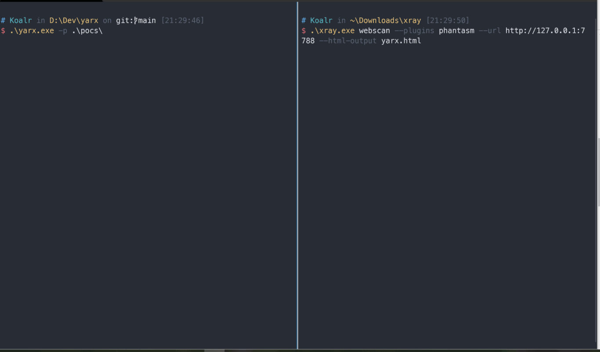
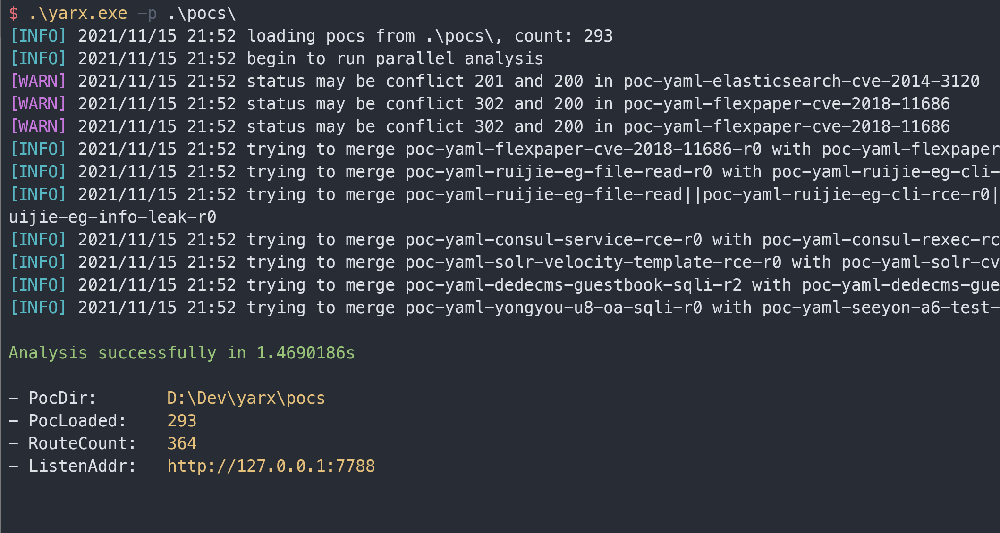

<div align="center">

</div>

<p align="center">
    <a href="#"><b>在线体验</b></a>&nbsp;&nbsp;&nbsp;
    <a href="#"><b>漏洞报告</b></a> 
</p>

## Yarx 是什么

Yarx 来自于 `x-r-a-y` 的反向拼写，它能够根据 xray 的 yaml poc 规则全自动的生成一个满足规则要求的 Server，使用 xray 扫描该 Server 将会扫描出对应的漏洞。它的核心工作原理如下：





它的主要特性有:

+ 支持 status、header、body 等位置的响应变换
+ 支持 `==` `contains` `submatch` 等各种匹配模式
+ 支持动态变量的渲染和捕获以及多级规则的变量追踪
+ 支持绝大部分内置函数的解析和调用
+ 通过路由合并和智能排序等策略有效减少路由冲突
+ 平铺式规则处理逻辑，支持并发扫描
+ 支持捕获扫描事件做进一步分析联动

加载 xray 仓库 poc 并使用 xray 1.8.2 版本扫描结果如下：



## 使用场景

+ 作为**蜜罐**服务，精准探测 xray 的扫描态势
+ 作为**反制**服务，有效干扰 xray 正常的漏洞扫描
+ 作为**测试**服务，检测 xray 的运行是否正常

## 安装

建议直接从 [Release](https://github.com/zema1/yarx/releases) 中下载对应平台二进制文件，解压后在命令行直接使用无需安装。

如果需要自行构建，clone 仓库进入目录并运行编译命令即可在目录中生成一个二进制文件。

```bash
 GO111MODULE=on go build ./cmd/yarx/
```
## 用法

```bash
USAGE:
   ./yarx [global options] [arguments...]

GLOBAL OPTIONS:
   --pocs value, -p value    load pocs from this dir
   --listen value, -l value  the http server listen address (default: "127.0.0.1:7788")

   --verbose, -V             verbose mode, which is  equivalent to --log-level debug (default: false)
   --help, -h                show help (default: false)
```

Yarx 的使用非常简单，你只需指定一个包含 yaml poc 的文件夹并指定一个 http 服务的监听地址，Yarx 就会自动的加载文件夹中所有的 poc 规则并绑定到 server 的处理函数中。

```bash
# 创建一个 8080 端口的 http server 模拟 pocs 文件夹中的所有漏洞
./yarx -p ./pocs -l 0.0.0.0:8080
```


你可以使用本仓库的 [pocs](./pocs) 文件夹，也可以直接使用 xray 官方仓库的 [https://github.com/chaitin/xray/tree/master/pocs](https://github.com/chaitin/xray/tree/master/pocs) 文件夹。本仓库仅仅是去掉了暂时不支持的 poc，后者除了在运行时会打印一点错误信息之外没有任何区别，我会定期同步数据来增加更多 poc。当然，你也可以指定自己编写的 poc。

## 开发

Yarx 也可以作为 go 的 package 来使用

```go
yr := &yarx.Yarx{}
// err := yr.Parse([]byte("poc-data"))
err := yr.ParseFile("/path/to/a/yaml/poc")
if err != nil {
    panic(err)
}

// 每个成功加载的 poc 对应一个 MutationChain
// poc 中的 rule 则对应于 MutationRule
chains := yr.Chains()
rules := yr.Rules()
...

// 一键生成上述规则的 http handler
handler := yr.HTTPHandler()

// 事件处理
handler.OnRuleMatch(func(e *yarx.ScanEvent) {
})
handler.OnPocMatch(func(e *yarx.ScanEvent) {
    fmt.Println(e.RemoteAddr)
    fmt.Println(e.Request)
    fmt.Println(e.Response)
    fmt.Println(e.PocMatched)
    fmt.Println(e.RuleMatched)
})

// 启动服务
http.ListenAndServe(handler, "127.0.0.1:7788")
```

## 错误说明

Yarx 在解析 poc 的过程中可能会出现错误，这些 poc 不会被加载到最终的 http 服务中，遇到错误时不要惊慌，基本都是这几类问题：

+ 不支持路径本身太灵活的

  主要是 `{{name}}.php` 和 `/` 之类的路径，这些路径作为路由时无法与其他类似的规则区分开，目测无解（相信我，Yarx 已经尽了最大努力避免路有冲突）

+ 不支持 `set` 定义中存在复杂转换的情况，如：

  ```yaml
  set:
    r0: randLowercase(8)
    r1: base64(r0) # 追踪这个变量太复杂，不打算支持
  ```
  
+ 不支持使用反连平台的，即 yaml 中有 `newReverse()` 调用的，后续有计划支持

如果你遇到其他类型的报错，可以提交一个 issue，带上报错的 yaml poc 即可，我会尽快处理。

## 规划

- [ ] 支持自定义未找到路径的目录
- [ ] 支持 Docker 一键部署
- [ ] 支持依赖反连平台的 POC
- [ ] 支持依赖 request 的 POC

## 更新日志

* 0.1
    * 第一版发布

